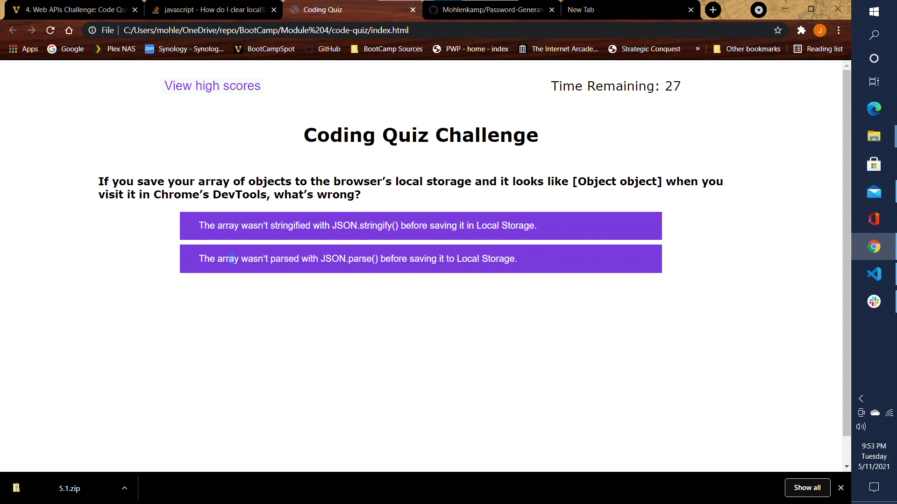

# code-quiz

## John Mohlenkamp
## May 11, 2021

## GitHub Location: https://github.com/Mohlenkamp/code-quiz

## GitPages Location: https://mohlenkamp.github.io/code-quiz/index.html

## Description
### This is primarily a javascript program which will generate a technical code quiz with randomized buttons for correct answers. There are 11 questions with either 2 or 4 possible answers. It is a timed quiz with 75 seconds to start. Correct answers are worth 7 points, but 3 points and 10 seconds are subtracted for each wrong answer. You get 50 points for just trying. The game will record the top 3 scores.

